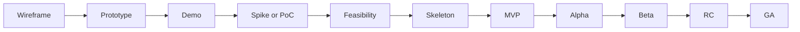

# 소프트웨어 개발 단계별 산출물 정리

## 1. 서론
소프트웨어 개발은 단순히 아이디어를 구현하는 과정이 아니라, **아이디어 검증 → 기술 검토 → 구조 확립 → 시장 반응 → 정식 출시**로 이어지는 여러 단계를 거칩니다. 
각 단계마다 성격과 목적이 다르며, 산출물의 형태도 달라집니다. 본 문서에서는 대표적인 용어와 그 의미를 정리하고, 전체 흐름을 시각적으로 보여줍니다.

---

## 2. 본론: 단계별 용어 정리

| 용어              | 목적/초점       | 특징               | 산출물/예시               |
| --------------- | ----------- | ---------------- | -------------------- |
| **Demo**        | 아이디어/컨셉 시연  | 완성도 낮아도 됨, 보여주기용 | 클릭 더미, 화면 전환 영상      |
| **Wireframe**   | UI 구조 기획    | 코드 없음, 스케치 수준    | 화면 배치도               |
| **Prototype**   | UX/흐름 검증    | 일부 인터랙션 구현       | 피그마/Figma 시뮬레이션      |
| **Spike**       | 기술적 불확실성 탐색 | 단기간 실험, 가볍게      | 성능 테스트 스크립트          |
| **PoC**         | 기술 가능성 검증   | 성능·확장성 고려 안 함    | 데이터셋에 모델 적용          |
| **Feasibility** | 실행 타당성 검토   | 기술+비용+리스크 분석     | 보고서/분석 문서            |
| **Skeleton**    | 코드 구조 뼈대    | 기능은 최소, 프레임워크만   | 디렉토리+API 라우팅         |
| **MVP**         | 시장 검증       | 핵심 기능만 동작        | 주문·결제 되는 앱           |
| **Alpha**       | 내부 테스트      | 버그 많음, QA 중심     | 사내 버전                |
| **Beta**        | 외부 사용자 피드백  | 주요 기능 완성, 불안정    | 클로즈드 베타 앱            |
| **RC**          | 출시 직전 안정화   | 버그만 수정, 기능 고정    | Release Candidate 1  |
| **GA**          | 정식 출시       | 상용 수준 안정성        | App Store/Play 정식 배포 |

---

## 3. 전환: 단계의 흐름
위의 단계들은 각각 독립적이지 않고, **발전하는 흐름** 속에서 연결되어 있습니다.  
즉, 아이디어 검증에서 시작해 기술적 가능성을 확인하고, 구조를 잡고, 시장 반응을 테스트하며, 최종적으로 상용화에 이르는 과정입니다.  

**발전 순서:**  
Wireframe → Prototype → Demo → Spike/PoC → Feasibility → Skeleton → MVP → Alpha → Beta → RC → GA

---

## 4. 결론
정리하면, 소프트웨어 개발 단계별 산출물은 단순한 용어가 아니라,  
**"무엇을 검증하고, 어떤 산출물을 만들어야 하는가?"**를 명확히 하는 나침반 역할을 합니다.  
이 흐름을 이해하면 팀은 불필요한 시행착오를 줄이고, 효율적으로 제품을 발전시킬 수 있습니다.  

---

## 5. 시각화 (Mermaid 다이어그램)

