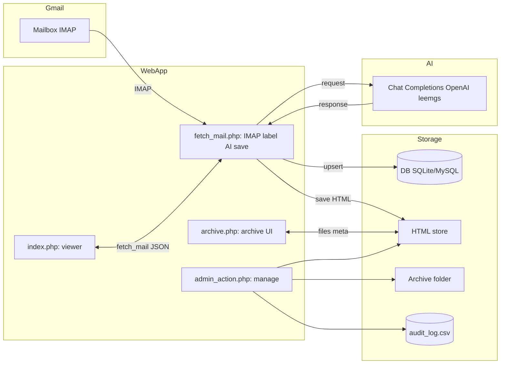

# AI 기반 데이타 수집/분류/보관/예측 시스템 (Flow: Gmail/IMAP → LLM → Web)

이 저장소는 **Gmail IMAP**으로 메일을 가져와, **키워드/라벨 기반 라우팅 + LLM 분석**을 통해
`소송/계약/거버넌스/보관` 폴더에 자동 저장하고, 웹 UI로 열람/관리할 수 있는 PHP 애플리케이션입니다.

- IMAP 수집 → 분류(라벨/키워드/LLM) → HTML 아카이브 생성 → 웹에서 조회
- OpenAI 또는 **OpenRouter(= `api_provider: leemgs`)** 중 하나로 LLM 호출

---

## 주요 기능

- **IMAP 수집**: 지정 라벨/키워드에 맞는 메일만 가져오기(옵션).
- **자동 분류/저장**: 소송/계약/거버넌스/보관으로 라우팅, HTML 문서 생성.
- **AI 추출**: 메일에서 제목/번호/상대방/일자 등 핵심 필드를 JSON으로 추출.
- **웹 UI**: 목록/검색/다운로드/삭제/보관/복원(관리 토큰 필요), 자동 갱신 폴링.
- **감사 로그**: `audit_log.csv`에 관리자 액션 기록.

---


## 🧱 아키텍처 다이어그램 (Mermaid)





## 폴더 구조


```
v04/
  config.php
  db.php
  imap_client.php
  ai_extractor.php
  fetch_mail.php
  download_attachment.php
  set_seen.php
  delete_mail.php
  index.php
  admin_action.php
  archive.php
  .gitignore
  .env.example
  Dockerfile
  docker-compose.yml
  docker/
    apache-vhost.conf
  static/
    logo.png
  (생성됨) 소송/ 계약/ 거버넌스/ 보관/
  (생성됨) /var/www/data/mailcache.sqlite (기본 설정 사용 시)
```

> 실제 저장 폴더 경로는 `config.php`의 디렉토리 설정을 따릅니다.

---

## 요구 사항

- PHP 8.1+
  - 확장: `imap`, `pdo_sqlite`(또는 `pdo_mysql`), `curl`, `mbstring`, `json`
- 웹서버(Apache/Nginx) 또는 PHP 내장 서버(개발용)
- (선택) Docker & Docker Compose

---

## 설치

### 1) 환경 변수 파일 준비

`.env.example`를 복사해 `.env`를 만들고 값을 채웁니다.

```bash
cp .env.example .env
vim .env
```

`.env` 주요 항목:

```dotenv
# === Gmail IMAP ===
GMAIL_USERNAME=yourname@gmail.com
GMAIL_APP_PASSWORD=앱비밀번호_또는_IMAP_비번   # 2단계 인증 사용 시 '앱 비밀번호' 필요

# === DB ===
# 기본: SQLite
DB_DSN=sqlite:/var/www/data/mailcache.sqlite
DB_USER=
DB_PASS=

# MySQL 예시
# DB_DSN=mysql:host=127.0.0.1;dbname=mailcache;charset=utf8mb4
# DB_USER=dbuser
# DB_PASS=dbpass

# === API Keys ===
OPENAI_API_KEY=sk-...
OPENROUTER_API_KEY=sk-or-...

# === 관리자 보호 토큰 ===
ADMIN_TOKEN=긴_랜덤_토큰
```

> `config.php`는 내부 미니 로더로 `.env`를 자동 로드하며, 값이 없을 경우만 기본값을 사용합니다.

### 2) Gmail 준비

- Gmail **설정 → 전달 및 POP/IMAP → IMAP 사용**.
- 계정에 2단계 인증(권장)을 켜고 **앱 비밀번호**를 발급 후 `.env`의 `GMAIL_APP_PASSWORD`에 입력.

### 3) 권한/디렉토리

- SQLite 기본 사용 시: `/var/www/data/` 디렉토리 생성 및 웹서버 쓰기 권한 부여.
  ```bash
  sudo mkdir -p /var/www/data
  sudo chown -R www-data:www-data /var/www/data
  sudo chmod 775 /var/www/data
  ```
- 아카이브 폴더(소송/계약/거버넌스/보관)는 자동 생성됩니다. 퍼미션 이슈 시 동일하게 권한을 조정하세요.

---

## 실행 방법

### A) Docker Compose (권장)

```bash
# 프로젝트 루트에서
docker compose up -d
# 또는
docker-compose up -d
```

- 브라우저에서 `http://localhost/` 접속
- `docker/apache-vhost.conf`로 `/var/www/html`에 소스가 탑재되도록 설정되어 있습니다.

### B) 로컬 PHP (개발용)

```bash
php -S 0.0.0.0:8080 -t v3
# http://localhost:8080 로 접속
```

> 실제 운영에선 Apache/Nginx를 사용하세요.

---

## LLM 프로바이더 설정

`config.php`의 `api_provider` 값으로 선택합니다.

- OpenAI 사용:
  ```php
  'api_provider' => 'openai',
  ```
  - `.env`의 `OPENAI_API_KEY` 필요
  - 모델: `openai_model` (기본 `gpt-4o-mini`)

- **OpenRouter 사용(= leemgs 분기)**:
  ```php
  'api_provider' => 'leemgs',
  ```
  - `.env`의 `OPENROUTER_API_KEY` 필요
  - 모델: `leemgs_model` (기본 `openai/gpt-4o`)
  - 엔드포인트: `https://openrouter.ai/api/v1/chat/completions`

> **참고**: `ai_extractor.php`에서 leemgs 분기는 이미 OpenRouter 규격(`Bearer` 토큰, `messages`, `temperature`, `max_tokens`)으로 맞춰져 있습니다.

---

## 웹 UI 사용법

- `index.php`: 메일 목록/검색/보기. 자동 갱신 주기(`poll_interval`)는 `config.php`에서 조절.
- `fetch_mail.php`: 메일 수집/갱신 API.
- `download_attachment.php`: 첨부파일 다운로드.
- `admin_action.php`: **보관/삭제/복원** 등의 관리자 액션(요청 시 `ADMIN_TOKEN` 필요).
- `archive.php`: 저장된 HTML 문서/아카이브 열람.

저장 위치(기본):
- `소송_dir`, `계약_dir`, `거버넌스_dir`, `보관_dir` 경로에 문서 생성
- 상단 로고/면책문(브랜딩)은 `config.php`의 `branding`에서 제어

---

## 분류 로직(요약)

`config.php`의 다음 옵션을 조합해 라우팅합니다.

- **라벨 → 카테고리 맵**: `category_label_map` + `category_label_match`
- **키워드 트리거**: `keywords`
- **LLM 분석 가드**:
  - `analysis_label_filter`: 지정 라벨 메일만 AI 분석
  - `analysis_match_mode`: `any|all`
  - `restrict_imap_search`: true면 **수집 자체**를 라벨로 제한
- **기타**:
  - `always_analysis`: 모든 메일 분석(비용 증가)
  - `exclusive_routing`: 배타 라우팅
  - `exclusive_priority`: 충돌 시 우선순위

---

## 보안 가이드

- `.gitignore`에 **`.env`** 포함(커밋 방지).
- `ADMIN_TOKEN`은 충분히 길고 추측 불가능한 값으로 설정.
- 가능한 한 `.env`와 아카이브 디렉토리를 **웹 루트 밖**에 두고 심볼릭 링크/별도 보호를 고려.
- 네트워크 환경에서 OpenRouter/OpenAI 키가 로그에 노출되지 않도록 주의.

---

## 트러블슈팅

- **IMAP 인증 실패**: IMAP 사용 설정/앱 비밀번호 확인, 계정 보호 조치(2FA 등) 재점검.
- **cURL 401/403**: API 키 확인(유효/활성/요금제), `Authorization: Bearer` 여부 확인.
- **권한 오류**: `/var/www/data` 또는 아카이브 폴더 쓰기 권한 확인.
- **타임아웃**: `ai_extractor.php`의 cURL 타임아웃을 조정하거나, 모델/토큰/프롬프트 크기 점검.
- **JSON 파싱 실패**: 모델 응답에 JSON 이외 텍스트가 섞이는 경우 프롬프트를 보수적으로 조정.

---

## 빠른 테스트 (OpenRouter 예시)

```bash
export OPENROUTER_API_KEY="sk-or-..."
curl https://openrouter.ai/api/v1/chat/completions   -H "Content-Type: application/json"   -H "Authorization: Bearer $OPENROUTER_API_KEY"   -d '{
    "model": "openai/gpt-4o",
    "messages": [
      {"role": "user", "content": "OpenAI API를 PHP에서 사용하는 예제를 보여줘."}
    ],
    "max_tokens": 512
  }'
```

---

## 감사 로그

- `audit_log.csv`에 관리자 액션이 기록됩니다(시간/액션/대상/아이디 등).

---
