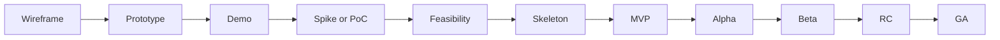

# Software Development Artifacts by Stage

## 1. Introduction

Software development is not simply the process of implementing an idea — it goes through multiple stages such as **idea validation → technical review → architecture establishment → market response → official release**.
Each stage has a different nature and purpose, and the artifacts produced also differ. This document summarizes the representative terms and their meanings, and visually presents the overall flow.

---

## 2. Main: Terminology by Stage

| Term            | Purpose/Focus                  | Characteristics                             | Artifact/Example                     |
| --------------- | ------------------------------ | ------------------------------------------- | ------------------------------------ |
| **Demo**        | Show idea/concept              | Low fidelity is fine, for show              | Click dummy, screen transition video |
| **Wireframe**   | Plan UI structure              | No code, sketch-level                       | Screen layout diagram                |
| **Prototype**   | Validate UX/flow               | Some interactions implemented               | Figma simulation                     |
| **Spike**       | Explore technical uncertainty  | Short-term, lightweight experiment          | Performance test script              |
| **PoC**         | Validate technical feasibility | No consideration of performance/scalability | Apply model to dataset               |
| **Feasibility** | Review execution feasibility   | Analyze technology + cost + risk            | Report/analysis document             |
| **Skeleton**    | Code structure skeleton        | Minimal functionality, only framework       | Directory + API routing              |
| **MVP**         | Market validation              | Only core features work                     | App with ordering/payment            |
| **Alpha**       | Internal testing               | Many bugs, QA-focused                       | In-house version                     |
| **Beta**        | External user feedback         | Main functions complete, unstable           | Closed beta app                      |
| **RC**          | Stabilization before release   | Bug fixes only, feature freeze              | Release Candidate 1                  |
| **GA**          | General availability           | Commercial-level stability                  | Official release in App Store/Play   |

---

## 3. Transition: Flow of Stages

The above stages are not independent; they are connected in a **progressive flow**.
In other words, the process begins with idea validation, moves on to confirming technical feasibility, establishing structure, testing market response, and ultimately achieving commercialization.

**Progression Order:**
Wireframe → Prototype → Demo → Spike/PoC → Feasibility → Skeleton → MVP → Alpha → Beta → RC → GA

---

## 4. Conclusion

In summary, the artifacts produced in each stage of software development are not just jargon — they serve as a **compass that clarifies “what to validate and what artifacts to produce.”**
Understanding this flow helps teams reduce unnecessary trial and error and evolve the product more efficiently.

---

## 5. Visualization (Mermaid Diagram)

---
