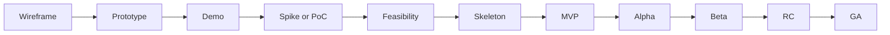

Wireframe → Prototype → Demo → Spike/PoC → Feasibility → Skeleton → MVP → Alpha → Beta → RC → GA 순으로 발전하는 흐름을 잡을 수 있습니다.

| 용어              | 목적/초점       | 특징               | 산출물/예시               |
| --------------- | ----------- | ---------------- | -------------------- |
| **Demo**        | 아이디어/컨셉 시연  | 완성도 낮아도 됨, 보여주기용 | 클릭 더미, 화면 전환 영상      |
| **Wireframe**   | UI 구조 기획    | 코드 없음, 스케치 수준    | 화면 배치도               |
| **Prototype**   | UX/흐름 검증    | 일부 인터랙션 구현       | 피그마/Figma 시뮬레이션      |
| **Spike**       | 기술적 불확실성 탐색 | 단기간 실험, 가볍게      | 성능 테스트 스크립트          |
| **PoC**         | 기술 가능성 검증   | 성능·확장성 고려 안 함    | 데이터셋에 모델 적용          |
| **Feasibility** | 실행 타당성 검토   | 기술+비용+리스크 분석     | 보고서/분석 문서            |
| **Skeleton**    | 코드 구조 뼈대    | 기능은 최소, 프레임워크만   | 디렉토리+API 라우팅         |
| **MVP**         | 시장 검증       | 핵심 기능만 동작        | 주문·결제 되는 앱           |
| **Alpha**       | 내부 테스트      | 버그 많음, QA 중심     | 사내 버전                |
| **Beta**        | 외부 사용자 피드백  | 주요 기능 완성, 불안정    | 클로즈드 베타 앱            |
| **RC**          | 출시 직전 안정화   | 버그만 수정, 기능 고정    | Release Candidate 1  |
| **GA**          | 정식 출시       | 상용 수준 안정성        | App Store/Play 정식 배포 |

